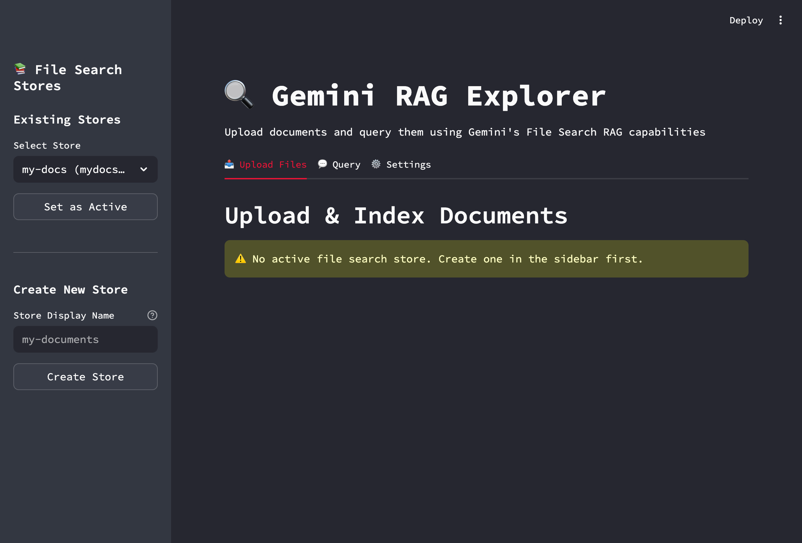
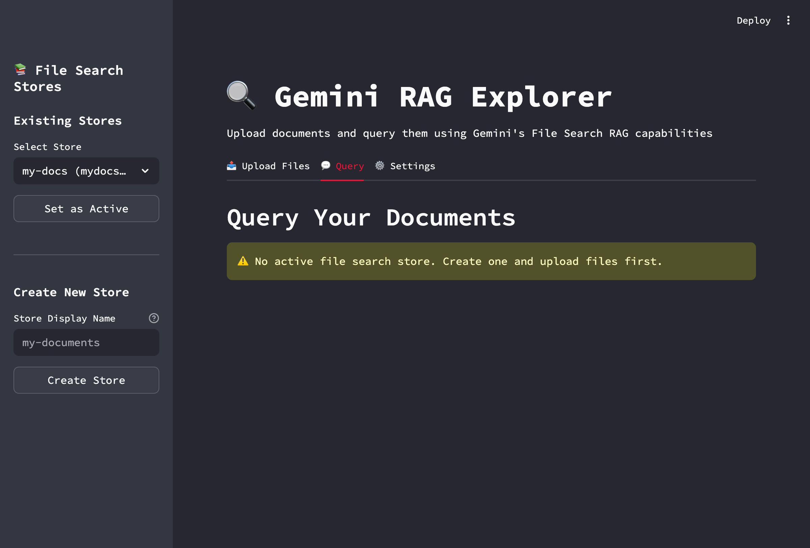

# Gemini RAG Explorer


A production-ready Streamlit application for exploring Google's Gemini File Search RAG (Retrieval Augmented Generation) capabilities. Built with type safety, comprehensive error handling, and developer-friendly architecture.

## Screenshots

### Main Interface


### Upload & Index Documents


### Query Your Documents


## Architecture

### Core Components

- **`app.py`**: Streamlit UI layer handling user interactions, session state, and progress tracking
- **`src/rag_service.py`**: Service layer wrapping Gemini File Search API with retry logic, error handling, and operation management
- **`src/config.py`**: Environment configuration and API key management

### Design Patterns

- **Service Layer Pattern**: Business logic separated from UI concerns
- **Retry Decorator**: Exponential backoff for transient API failures
- **Centralized Error Handling**: Consistent error parsing and user-friendly messages
- **Type Hints**: Full type coverage for better IDE support and maintainability

## Quick Start

### Prerequisites

- Python 3.9+
- Gemini API key ([Get one here](https://aistudio.google.com/apikey))

### Installation

```bash
# Clone the repository
git clone https://github.com/bantoinese83/Gemini-RAG-Explorer.git
cd Gemini-RAG-Explorer

# Create virtual environment
python3 -m venv venv
source venv/bin/activate  # On Windows: venv\Scripts\activate

# Install dependencies
pip install -r requirements.txt

# Configure environment
cp .env.example .env
# Edit .env and add your GEMINI_API_KEY
```

### Run

```bash
streamlit run app.py
```

Access at `http://localhost:8501`

## API Reference

### `GeminiRAGService`

Main service class for interacting with Gemini File Search API.

#### Methods

##### `create_file_search_store(display_name: str) -> str`

Creates a new file search store and sets it as current.

```python
from src.rag_service import GeminiRAGService

service = GeminiRAGService(api_key="your-key")
store_name = service.create_file_search_store("my-documents")
```

**Parameters:**
- `display_name`: Human-readable store name (max 100 chars)

**Returns:** Store name (e.g., `"fileSearchStores/abc123"`)

**Raises:**
- `ValueError`: Invalid display name or quota exceeded

---

##### `list_file_search_stores() -> List[Dict]`

Lists all available file search stores.

```python
stores = service.list_file_search_stores()
# [{"name": "fileSearchStores/abc", "display_name": "My Store"}, ...]
```

**Returns:** List of dicts with `name` and `display_name` keys

---

##### `upload_and_index_file(file_path: str, display_name: str, chunking_config: Optional[Dict] = None) -> Dict`

Uploads and indexes a file into the current store.

```python
operation = service.upload_and_index_file(
    file_path="document.pdf",
    display_name="My Document",
    chunking_config={
        "white_space_config": {
            "max_tokens_per_chunk": 512,
            "max_overlap_tokens": 50
        }
    }
)

# Wait for completion
service.wait_for_operation(
    operation["operation_name"],
    operation_obj=operation.get("operation_obj")
)
```

**Parameters:**
- `file_path`: Path to file (max 100 MB)
- `display_name`: Display name for citations
- `chunking_config`: Optional chunking configuration

**Returns:** Dict with `operation_name`, `operation_obj`, and `done` status

**Raises:**
- `FileNotFoundError`: File doesn't exist
- `ValueError`: File too large or unsupported format
- `RuntimeError`: Indexing operation failed

---

##### `wait_for_operation(operation_name: str, operation_obj: Optional[Any] = None, *, check_interval: int = 5, max_wait_time: int = 600, progress_callback: Optional[Callable[[str], None]] = None) -> bool`

Waits for an async operation to complete.

```python
def progress(msg: str):
    print(f"Status: {msg}")

success = service.wait_for_operation(
    operation_name="operations/abc123",
    operation_obj=operation_obj,
    progress_callback=progress,
    max_wait_time=300  # 5 minutes
)
```

**Parameters:**
- `operation_name`: Operation identifier (for logging)
- `operation_obj`: Operation object from API (preferred)
- `check_interval`: Seconds between status checks (default: 5)
- `max_wait_time`: Maximum wait time in seconds (default: 600)
- `progress_callback`: Optional callback for progress updates

**Returns:** `True` if operation completed successfully

**Raises:**
- `TimeoutError`: Operation exceeded max wait time
- `RuntimeError`: Operation failed

---

##### `query(prompt: str, store_name: Optional[str] = None, model: str = "gemini-2.5-flash", metadata_filter: Optional[str] = None) -> Dict`

Queries documents using semantic search.

```python
result = service.query(
    prompt="What is the main topic?",
    store_name="fileSearchStores/abc123",
    model="gemini-2.5-pro",
    metadata_filter="author='John Doe'"
)

print(result["text"])
for citation in result["citations"]:
    print(f"Source: {citation['file_name']}, Chunk: {citation['chunk_index']}")
```

**Parameters:**
- `prompt`: User query
- `store_name`: Store to search (defaults to current store)
- `model`: Model to use (`gemini-2.5-flash` or `gemini-2.5-pro`)
- `metadata_filter`: Optional metadata filter (see [AIP-160](https://google.aip.dev/160))

**Returns:** Dict with `text` (response) and `citations` (list of source references)

**Raises:**
- `ValueError`: Invalid prompt or store not found
- `RuntimeError`: Query failed

---

##### `delete_store(store_name: str, force: bool = True) -> None`

Deletes a file search store.

```python
service.delete_store("fileSearchStores/abc123", force=True)
```

**Parameters:**
- `store_name`: Store to delete
- `force`: Force deletion (default: `True`)

**Raises:**
- `ValueError`: Store not found

---

## Supported File Types

### Documents
PDF, DOCX, TXT, MD, RTF, ODT, Word templates

### Code
Python, JavaScript, TypeScript, Java, C/C++, Go, Rust, Ruby, PHP, Swift, Kotlin, Scala, and 50+ more

### Data
CSV, JSON, XML, YAML, SQL

### Web
HTML, CSS, JSX, TSX

### Other
LaTeX, Markdown, Jupyter notebooks, Shell scripts, and 100+ MIME types

See [Gemini File Search documentation](https://ai.google.dev/gemini-api/docs/file-search) for complete list.

## Configuration

### Environment Variables

```bash
GEMINI_API_KEY=your_api_key_here
```

### Chunking Strategy

Default chunking uses whitespace-based tokenization. Customize via `chunking_config`:

```python
chunking_config = {
    "white_space_config": {
        "max_tokens_per_chunk": 512,    # Max tokens per chunk
        "max_overlap_tokens": 50         # Overlap for context preservation
    }
}
```

**Recommendations:**
- **Small documents (< 10K tokens)**: `max_tokens_per_chunk: 256`, `max_overlap_tokens: 20`
- **Medium documents (10K-100K tokens)**: `max_tokens_per_chunk: 512`, `max_overlap_tokens: 50`
- **Large documents (> 100K tokens)**: `max_tokens_per_chunk: 1024`, `max_overlap_tokens: 100`

## Error Handling

The service implements comprehensive error handling with automatic retries:

- **Transient Errors**: Automatic retry with exponential backoff (3 attempts)
- **Quota Errors**: Clear error messages with context
- **Validation Errors**: Pre-flight checks before API calls
- **Operation Timeouts**: Configurable with fallback mechanisms

### Error Types

```python
try:
    service.upload_and_index_file("doc.pdf", "My Doc")
except ValueError as e:
    # Validation or quota errors
    print(f"Validation error: {e}")
except RuntimeError as e:
    # Operation failures
    print(f"Operation failed: {e}")
except TimeoutError as e:
    # Timeout during indexing
    print(f"Timeout: {e}")
```

## Development

### Project Structure

```
gemini-rag/
├── app.py                      # Streamlit UI
├── src/
│   ├── __init__.py
│   ├── rag_service.py          # Core RAG service (460 lines)
│   └── config.py               # Config management
├── examples/
│   ├── sample_document.txt     # Test document
│   └── README.md
├── requirements.txt            # Dependencies
├── .env.example                # Env template
├── .gitignore
└── README.md
```

### Code Quality

```bash
# Format code
black .

# Lint
ruff check .

# Type checking (if using mypy)
mypy src/
```

### Testing

```python
# Example test
from src.rag_service import GeminiRAGService

service = GeminiRAGService(api_key="test-key")
# Test implementation...
```

### Dependencies

- `google-genai`: Gemini API client
- `streamlit`: Web UI framework
- `python-dotenv`: Environment variable management
- `black`: Code formatter
- `ruff`: Fast linter

## Rate Limits & Pricing

### Limits

- **File size**: 100 MB per document
- **Storage tiers**:
  - Free: 1 GB total
  - Tier 1: 10 GB
  - Tier 2: 100 GB
  - Tier 3: 1 TB
- **Recommendation**: Keep individual stores < 20 GB for optimal latency

### Pricing

- **Embeddings (indexing)**: $0.15 per 1M tokens
- **Storage**: Free
- **Query embeddings**: Free
- **Retrieved tokens**: Charged as regular context tokens

See [Gemini Pricing](https://ai.google.dev/gemini-api/docs/pricing) for details.

## Advanced Usage

### Metadata Filtering

Add metadata when uploading:

```python
# In upload_and_index_file, metadata is passed via config
# (Note: Current implementation uses upload_to_file_search_store)
# Metadata support can be added via custom_metadata parameter
```

Filter queries:

```python
result = service.query(
    prompt="Find information about X",
    metadata_filter="author='John Doe' AND year > 2020"
)
```

See [AIP-160](https://google.aip.dev/160) for filter syntax.

### Multiple Stores

```python
# Create multiple stores for different document sets
legal_store = service.create_file_search_store("legal-docs")
tech_store = service.create_file_search_store("tech-docs")

# Query specific store
result = service.query("What is...", store_name=legal_store)
```

### Operation Monitoring

```python
def progress_callback(msg: str):
    logger.info(f"Progress: {msg}")
    # Could update UI, send notifications, etc.

service.wait_for_operation(
    operation_name="ops/123",
    operation_obj=op,
    progress_callback=progress_callback
)
```

## Troubleshooting

### Common Issues

**"Quota exceeded"**
- Check your API quota limits
- Reduce file sizes or chunk counts

**"Operation timed out"**
- Increase `max_wait_time` in `wait_for_operation`
- Check file size (large files take longer)

**"Store not found"**
- Verify store name format: `fileSearchStores/...`
- List stores to see available names

**"Unsupported file format"**
- Check file extension matches content
- See supported types list above

## Contributing

1. Fork the repository
2. Create a feature branch (`git checkout -b feature/amazing-feature`)
3. Make changes with tests
4. Run `black .` and `ruff check .`
5. Commit (`git commit -m 'Add amazing feature'`)
6. Push (`git push origin feature/amazing-feature`)
7. Open a Pull Request

## License

MIT License - see LICENSE file for details

## References

- [Gemini File Search Documentation](https://ai.google.dev/gemini-api/docs/file-search)
- [File Search Stores API](https://ai.google.dev/api/file-search/file-search-stores)
- [File Search Documents API](https://ai.google.dev/api/file-search/documents)
- [Gemini Embeddings](https://ai.google.dev/gemini-api/docs/embeddings)
- [AIP-160: List Filters](https://google.aip.dev/160)

## Changelog

### v1.0.0
- Initial release
- File search store management
- Document upload and indexing
- Semantic querying with citations
- Custom chunking configuration
- Comprehensive error handling
- Retry logic with exponential backoff
